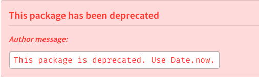

# lodash 源码阅读 —— now

> "Dude, suckin' at something is the first step to being sorta good at something." —Jake, "Adventure Time"

本文为 《lodash 源码阅读》 系列文章，后续内容会在 [github](https://github.com/gu-xionghong/lodash-analysis) 中发布，欢迎 star，[gitbook](https://gu-xionghong.gitbook.io/lodash-analysis/) 同步更新。

## 源码

```js
/** 用作对当前上下文Date.now的引用 */
var ctxNow = Date && Date.now !== root.Date.now && Date.now;

/*------------------------------------------------------------------------*/

/**
 * 获得 Unix 纪元 (1 January 1970 00:00:00 UTC) 直到现在的毫秒数。
 *
 * @static
 * @memberOf _
 * @since 2.4.0
 * @category Date
 * @returns {number} 返回时间戳。
 */
var now =
  ctxNow ||
  function() {®
    return root.Date.now();
  };
```

## 原理

从代码中我们可以看出，`_.now` 是对当前环境 `Date.now` 的引用，这个方法起初的目标是为了兼容不同上下文情况下对 `Date.now` 的引用，但是使用场景并不多（作者没有联想到场景），故在 [v4.0.2](https://www.npmjs.com/package/lodash.now) 更新之后，官方宣布弃用这个 api，建议直接使用 `Date.now` 。

